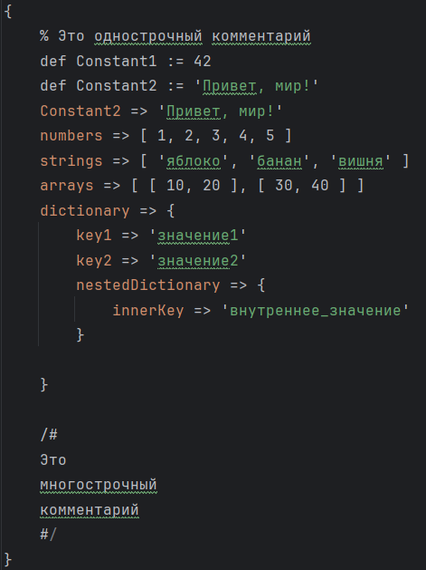

# Задание №3 (Вариант 15)

Разработать инструмент командной строки для учебного конфигурационного
языка, синтаксис которого приведен далее. Этот инструмент преобразует текст из
входного формата в выходной. Синтаксические ошибки выявляются с выдачей
сообщений.
Входной текст на языке json принимается из файла, путь к которому задан
ключом командной строки. Выходной текст на учебном конфигурационном
языке попадает в файл, путь к которому задан ключом командной строки.
Однострочные комментарии:
% Это однострочный комментарий
Многострочные комментарии:
/#
Это многострочный
комментарий
#/
Массивы:
[ значение, значение, значение, ... ]
Словари:
{
 имя => значение,
 имя => значение,
 имя => значение,
 ...
}
Имена:
76
[a-zA-Z][a-zA-Z0-9]*
Значения:
• Числа.
• Строки.
• Массивы.
• Словари.
Строки:
'Это строка'
Объявление константы на этапе трансляции:
def имя := значение
Вычисление константы на этапе трансляции:
!(имя)
Результатом вычисления константного выражения является значение.
Все конструкции учебного конфигурационного языка (с учетом их
возможной вложенности) должны быть покрыты тестами. Необходимо показать 2
примера описания конфигураций из разных предметных областей

Конф_3_image2.png
Конф_3_image1.png

<table>
  <tr>
    <td>
      
    </td>
    <td>
      
    </td>
  </tr>
</table>
